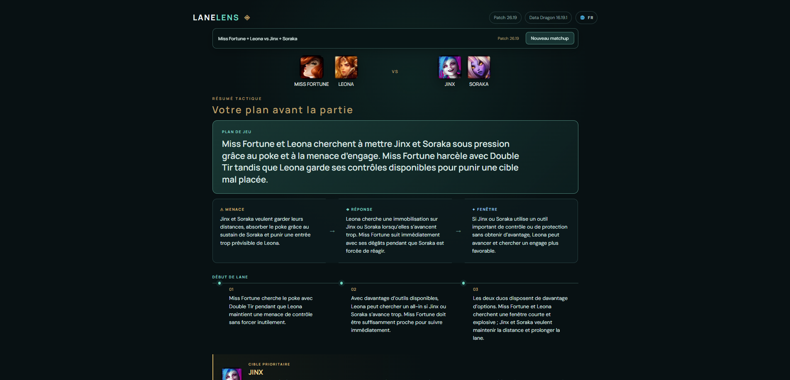

# LaneLens

> Le plan de jeu de ta botlane avant que les sbires arrivent.

LaneLens aide les joueurs de League of Legends à comprendre **comment jouer un matchup botlane précis à partir des quatre champions présents**.

Choisissez votre carry, votre support et la botlane adverse. LaneLens transforme les interactions entre les quatre kits en un plan de jeu concret : quoi respecter, quand avancer, qui cibler, comment gérer la wave et quelles erreurs éviter.

<p align="center">
  
</p>

## Pourquoi LaneLens ?

Connaître les quatre champions ne suffit pas toujours à savoir comment jouer la lane.

Entre les timings de niveaux, les cooldowns, la wave, les fenêtres d'engage et les interactions entre carry et support, la vraie question est souvent :

> **Qu'est-ce qu'on doit réellement faire dans cette botlane ?**

LaneLens répond à cette question avec une analyse structurée, actionnable et centrée sur le **2v2 complet**, pas uniquement sur un duel champion contre champion.

## État du projet

LaneLens est en **alpha** et dispose désormais d'un déploiement public de test sur Render :

https://lanelens.onrender.com

Le parcours principal est fonctionnel :

```text
4 champions
    ↓
analyse
    ↓
résumé tactique
    ↓
analyse détaillée
    ↓
historique local
```

Le socle de production est également en place :

```text
feature
   ↓ PR
 main
   ↓ promotion
 production
   ↓
 CI
   ↓
 Render
   ↓
 smoke test
```

Les travaux en cours portent principalement sur la conformité Riot, l'exploitation des retours alpha et le durcissement avant une diffusion plus large.

## Fonctionnalités disponibles

- sélection des quatre champions de la botlane ;
- recherche instantanée dans le catalogue League of Legends ;
- portraits et données champions via Riot Data Dragon ;
- gestion des matchups miroir ;
- moteur d'analyse backend provider-agnostic ;
- providers OpenAI, Google Gemini et Groq ;
- contexte de patch versionné ;
- API `POST /api/matchup` ;
- endpoint `GET /api/analysis-context` ;
- validation structurelle des réponses IA ;
- garde-fous déterministes de conformité gameplay ;
- validation de la langue de l'analyse ;
- résumé tactique et analyse détaillée ;
- cheat sheet copiable ;
- historique local des dix dernières analyses ;
- interface française par défaut avec architecture i18n ;
- logs backend structurés avec `X-Request-Id` ;
- diagnostic sécurisé des erreurs provider ;
- feedback testeur envoyé vers un tracker GitHub configurable ;
- télémétrie produit pseudonyme minimale ;
- CI GitHub Actions ;
- Dependabot pour npm et GitHub Actions ;
- déploiement Render depuis la branche `production` ;
- healthcheck Render sur `GET /api/health` ;
- smoke test de production GitHub Actions.

## En cours / avant ouverture plus large

- conformité Riot et mentions produit tiers ;
- consolidation des retours alpha ;
- protection renforcée contre l'abus des endpoints publics ;
- amélioration progressive des garde-fous gameplay ;
- préparation d'une Knowledge Base gameplay structurée à partir des besoins réellement observés.

> Les garde-fous gameplay réduisent certaines erreurs déterministes, mais ne constituent pas une preuve formelle de justesse de toute recommandation tactique.

---

# Pour les développeurs

## Stack

```text
Frontend     TypeScript · Vite · HTML · CSS
Backend      Node.js · Hono
Data         Riot Data Dragon
AI           MatchupAnalysisProvider · OpenAI · Gemini · Groq
Storage      localStorage / sessionStorage côté navigateur
Feedback     GitHub Issues configurable côté serveur
Logs         JSONL en local · stdout/stderr en production
Hosting      Render
Tests        TypeScript · node:test
CI/CD        GitHub Actions
```

## Prérequis

LaneLens utilise Node.js :

```text
>= 22.13.1 < 23
```

## Démarrage local

```sh
npm ci
npm run dev
```

Ouvrir :

```text
http://127.0.0.1:5173
```

Cette commande lance le backend puis attend que `GET /api/health` réponde avant de démarrer Vite.

Backend local :

```text
http://127.0.0.1:3000
```

Healthcheck :

```http
GET /api/health
```

Réponse :

```json
{
  "status": "ok"
}
```

## API actuelle

```http
GET  /api/health
GET  /api/analysis-context
POST /api/matchup
POST /api/feedback
POST /api/telemetry
```

Le frontend et le backend partagent leurs contrats via `shared/`.

Chaque requête HTTP reçoit un `X-Request-Id` généré côté serveur afin de corréler les erreurs utilisateur et les logs.

## Configuration de l'analyse IA

Copier la configuration d'exemple :

```powershell
Copy-Item .env.example .env
```

Puis sélectionner un provider.

### Groq

```env
AI_PROVIDER=groq
GROQ_API_KEY=
GROQ_MODEL=openai/gpt-oss-120b
GROQ_TIMEOUT_MS=30000
```

### OpenAI

```env
AI_PROVIDER=openai
OPENAI_API_KEY=
OPENAI_MODEL=gpt-6-sol
OPENAI_TIMEOUT_MS=30000
```

### Gemini

```env
AI_PROVIDER=gemini
GEMINI_API_KEY=
GEMINI_MODEL=gemini-3.8-flash
GEMINI_TIMEOUT_MS=30000
```

Une valeur `AI_PROVIDER` absente conserve OpenAI pour compatibilité avec les configurations existantes.

Il n'existe aucun fallback automatique entre providers.

Sans clé exploitable pour le provider sélectionné :

```text
POST /api/matchup
→ 503 ANALYSIS_NOT_CONFIGURED
```

Les secrets restent exclusivement côté serveur.

Ne jamais placer une clé dans :

```text
src/
public/
VITE_*
```

## Architecture de l'analyse

```text
Frontend
   ↓
POST /api/matchup
   ↓
Hono
   ↓
PatchContextResolver
   ↓
GameplayContextResolver
   ↓
MatchupAnalysisService
   ↓
MatchupAnalysisProvider
   ↓
Provider concret
   ↓
validation structurelle
   ↓
validation gameplay
   ↓
validation langue
   ↓
MatchupAnalysis
```

Le contrôleur HTTP ne dépend d'aucun SDK LLM. Le runtime choisit le provider à partir de la configuration puis l'injecte derrière `MatchupAnalysisProvider`.

Changer de modèle ou de provider ne doit pas nécessiter de modifier le frontend, le contrat HTTP ou le service métier.

Voir [Architecture technique](docs/architecture.md).

## Contexte gameplay

LaneLens embarque un snapshot Data Dragon généré pour fournir au moteur d'analyse des faits statiques sur les champions.

Les informations déterministes supplémentaires sont ajoutées dans une couche de confiance LaneLens utilisée par les garde-fous de conformité.

Le validateur peut notamment détecter certaines incohérences liées :

- au niveau de disponibilité d'une capacité ;
- au champion ou au slot associé ;
- à certains effets et modes de ciblage ;
- à des interactions mécaniques non supportées ;
- à des valeurs exactes non justifiées ;
- à des claims de lethal absolus ;
- à des incohérences temporelles ;
- à certaines contradictions de plan de wave.

Cette couche reste volontairement conservatrice et sera enrichie à partir des erreurs réellement observées en alpha.

## Contexte de patch

Le patch utilisé pour l'analyse n'est pas déduit automatiquement de la version Data Dragon.

Les contextes supportés sont préparés et versionnés côté serveur.

Contexte actuellement embarqué :

```text
26.19-v1
```

Voir [Maintenance des contextes de patch](docs/patch-context.md).

## Catalogue des champions

Le catalogue visible dans le frontend est chargé depuis Riot Data Dragon selon la locale active.

LaneLens :

- recherche la dernière version Data Dragon disponible ;
- conserve le dernier catalogue valide dans `localStorage` ;
- réutilise ce cache si Data Dragon devient temporairement indisponible ;
- ne nécessite aucune clé Riot pour ces données statiques.

La version Data Dragon est une version technique et n'est pas utilisée comme détection automatique du patch joueur.

## Historique local

Les analyses valides affichées peuvent être conservées localement dans le navigateur.

L'historique :

- conserve au maximum dix entrées ;
- mémorise un snapshot des quatre champions, le patch, la locale, l'analyse et la date de génération ;
- remplace une entrée existante pour le même matchup/patch/locale ;
- reste consultable sans dépendre du catalogue Data Dragon courant ;
- ne nécessite aucune base de données.

## Télémétrie alpha

LaneLens utilise une télémétrie pseudonyme minimale pour mesurer l'usage de l'alpha.

Elle repose sur :

- un `clientId` aléatoire conservé dans `localStorage` ;
- un `sessionId` aléatoire conservé dans `sessionStorage` ;
- des événements fonctionnels limités : ouverture, analyses, historique et feedback.

Aucun compte Riot n'est nécessaire et LaneLens ne collecte pas d'identité Riot dans ce parcours.

## Feedback testeur

Le backend peut créer des tickets de feedback dans un dépôt GitHub configuré uniquement côté serveur.

Variables :

```env
FEEDBACK_GITHUB_TOKEN=
FEEDBACK_GITHUB_OWNER=
FEEDBACK_GITHUB_REPOSITORY=
```

Les entrées utilisateur sont validées et normalisées avant d'être envoyées au tracker.

## Logs backend

En local, le serveur écrit des logs JSON Lines avec rétention configurable.

En production, il utilise stdout/stderr afin de s'intégrer aux logs Render.

Les clés, tokens, cookies, mots de passe et secrets sont masqués. Les prompts complets, contextes complets et réponses LLM complètes ne sont pas journalisés.

## Vérification du projet

```sh
npm run lint
npm run typecheck
npm test
npm run build
```

La CI exécute également :

```sh
npm audit --audit-level=high
```

Le build produit :

```text
dist/
├── client/
└── server/
```

## Déploiement

Le déploiement public actuel utilise un seul service Render :

```text
production
    ↓
Render
    ↓
Node / Hono
├── frontend compilé
└── /api/*
```

Build :

```sh
npm ci && npm run build
```

Start :

```sh
npm run start:server
```

Healthcheck :

```text
/api/health
```

Après une CI réussie sur `production`, le workflow de smoke test attend le déploiement Render correspondant au commit puis vérifie l'endpoint public de santé.

## Périmètre actuel

LaneLens reste volontairement léger :

- pas de compte utilisateur ;
- pas de base de données utilisateur ;
- pas de compte Riot obligatoire ;
- pas de Riot API authentifiée ;
- pas de fallback automatique entre providers ;
- pas de paiement ;
- pas de domaine personnalisé requis.

## Documentation

- [Architecture technique](docs/architecture.md)
- [Maintenance des contextes de patch](docs/patch-context.md)

## Références techniques

- [Vite](https://vite.dev/guide/)
- [Hono sur Node.js](https://hono.dev/docs/getting-started/nodejs)
- [Riot Data Dragon](https://developer.riotgames.com/docs/lol#data-dragon)
