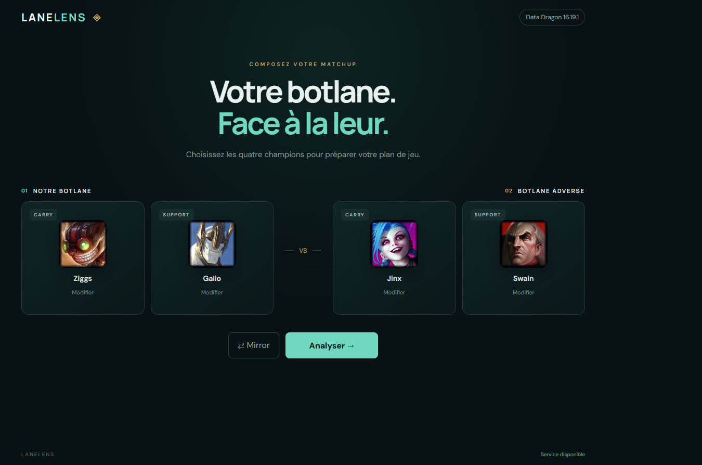

# LaneLens

> Know the matchup before it knows you.

LaneLens aide les joueurs de League of Legends à comprendre **comment jouer une botlane précise**.

Choisissez les quatre champions du matchup et obtenez un plan de jeu concret :
quoi respecter, quand avancer, qui cibler, comment gérer la wave et quelles erreurs éviter.

<p align="center">
  
</p>

## Pourquoi LaneLens ?

Connaître les quatre champions ne suffit pas toujours à savoir comment jouer la lane.

Entre les matchups, les timings de niveaux, les cooldowns, la wave et les fenêtres
d'engage, la vraie question est souvent beaucoup plus simple :

> **Qu'est-ce qu'on doit réellement faire dans cette botlane ?**

LaneLens est conçu pour répondre à cette question avec une analyse courte,
actionnable et centrée sur les interactions entre les quatre champions.

## Ce que LaneLens analyse

Pour un matchup comme :

```text
Ziggs + Galio
vs
Jinx + Swain
```

LaneLens structure l'analyse autour de points directement utiles en partie :

- plan de lane ;
- principales menaces adverses ;
- réponse à ces menaces ;
- fenêtres de trade et d'engage ;
- plan des niveaux 1, 2 et 3 ;
- gestion de wave ;
- cible prioritaire ;
- plan après le niveau 6 ;
- opportunités de roaming ;
- cheat sheet ;
- règle essentielle à retenir.

L'objectif n'est pas de réciter les sorts des champions, mais de transformer le
matchup en **décisions concrètes**.

## Fonctionnalités

### Disponible

- sélection des quatre champions de la botlane ;
- recherche instantanée dans le catalogue League of Legends ;
- portraits et données champions via Riot Data Dragon ;
- gestion des matchups miroir ;
- moteur d'analyse backend ;
- analyse IA structurée ;
- contexte de patch versionné ;
- API `POST /api/matchup` ;
- validation des réponses avant affichage.

### En cours

- affichage complet de l'analyse dans l'interface ;
- Quick Overlay pour consulter l'essentiel très rapidement ;
- historique local des derniers matchups ;
- UX et responsive final du MVP.

## Philosophie du projet

LaneLens cherche à rester simple :

```text
4 champions
      ↓
1 matchup
      ↓
1 plan de jeu clair
```

Pas de compte Riot obligatoire, pas de statistiques envahissantes et pas de
dashboard complexe pour répondre à une question de lane.

---

# Pour les développeurs

## Stack

```text
Frontend    TypeScript · Vite · HTML · CSS
Backend     Node.js · Hono
Data        Riot Data Dragon
AI          MatchupAnalysisProvider · OpenAI · Google Gemini
Tests       TypeScript · Node.js
```

## Démarrage local

Prérequis : Node.js >= 22.12 et npm.

```sh
npm ci
npm run dev
```

Ouvrir :

```text
http://127.0.0.1:5173
```

Cette commande lance le frontend Vite et l'API Hono ensemble.

Le backend est disponible sur :

```text
http://127.0.0.1:3000
```

Le health check :

```http
GET /api/health
```

retourne :

```json
{
  "status": "ok"
}
```

## Configuration de l'analyse IA

Aucune clé n'est nécessaire pour démarrer l'application ou utiliser
`GET /api/health`.

Pour activer une analyse réelle :

```powershell
Copy-Item .env.example .env
```

Puis sélectionner un provider et renseigner sa clé uniquement dans le fichier
local `.env`.

### Gemini

```env
AI_PROVIDER=gemini
GEMINI_API_KEY=
GEMINI_MODEL=gemini-3.8-flash
GEMINI_TIMEOUT_MS=30000
```

`GEMINI_MODEL` et `GEMINI_TIMEOUT_MS` sont facultatifs. Le niveau sans frais de
Gemini reste soumis aux quotas, aux conditions d'utilisation et à la politique
de traitement des données de Google associée au free tier. LaneLens envoie
uniquement les quatre noms de champions, le patch, le contexte de patch et les
instructions tactiques nécessaires à l'analyse.

### OpenAI

```env
AI_PROVIDER=openai
OPENAI_API_KEY=sk-...
OPENAI_MODEL=gpt-6-sol
OPENAI_TIMEOUT_MS=30000
```

`OPENAI_MODEL` et `OPENAI_TIMEOUT_MS` sont facultatifs.
Le backend charge automatiquement `.env` au démarrage. Le fichier est ignoré
par Git ; `.env.example` doit toujours rester sans secret.

Sans clé exploitable pour le provider sélectionné :

```text
POST /api/matchup
→ 503 ANALYSIS_NOT_CONFIGURED
```

Les secrets restent exclusivement côté serveur.

Ne jamais placer une clé dans :

```text
src/
public/
VITE_*
```

## Architecture

Le moteur d'analyse reste indépendant du provider concret :

```text
Frontend
   ↓
POST /api/matchup
   ↓
Hono
   ↓
MatchupAnalysisService
   ↓
MatchupAnalysisProvider
   ↓
Provider concret
   ↓
validation LaneLens
   ↓
MatchupAnalysis
```

Les providers actuellement intégrés sont OpenAI et Google Gemini. Le provider
est sélectionné avec `AI_PROVIDER=openai` ou `AI_PROVIDER=gemini`. Une valeur
absente conserve OpenAI pour compatibilité avec les configurations existantes.
Il n'existe aucun fallback automatique entre providers.

Changer de modèle ou de provider ne doit pas nécessiter de modifier :

- le frontend ;
- le contrat HTTP ;
- `MatchupAnalysisService` ;
- le contrat `MatchupAnalysis`.

LaneLens conserve la responsabilité :

- du contexte de patch ;
- des instructions métier ;
- de la validation finale de l'analyse.

## Contexte de patch

Le patch utilisé pour l'analyse n'est pas déduit automatiquement de la version
Data Dragon.

Les contextes supportés sont préparés et versionnés côté serveur.

Contexte actuellement disponible :

```text
26.19-v1
```

Voir [Maintenance des contextes de patch](docs/patch-context.md).

## Test manuel de l'analyse

Renseigner la clé du provider sélectionné dans le fichier local `.env`, puis
redémarrer le serveur :

```sh
npm run dev:server
```

Exemple :

```sh
curl -X POST http://127.0.0.1:3000/api/matchup \
  -H "Content-Type: application/json" \
  -d '{
    "allyCarry": "Ziggs",
    "allySupport": "Galio",
    "enemyCarry": "Jinx",
    "enemySupport": "Swain",
    "patch": "26.19"
  }'
```

Avec une configuration valide, la réponse attendue est un `MatchupAnalysis`
avec HTTP 200.

Ce test manuel n'est jamais exécuté par `npm test`.

## Catalogue des champions

Le catalogue est chargé depuis Riot Data Dragon en `fr_FR`.

LaneLens :

- recherche la dernière version Data Dragon disponible ;
- conserve le dernier catalogue valide dans `localStorage` ;
- réutilise ce cache si Data Dragon devient temporairement indisponible ;
- ne nécessite aucune clé Riot.

La version Data Dragon est une version technique et n'est pas utilisée comme
détection automatique du patch joueur.

Voir le [rapport LAN-002](docs/LAN-002/verification.md).

## Champion Picker

L'interface propose quatre slots :

```text
Carry allié
Support allié
Carry adverse
Support adverse
```

La recherche est insensible à la casse et les sélections restent modifiables.

Les doublons sont bloqués dans une même équipe.

Le mode Mirror permet au même champion d'apparaître une fois dans chaque équipe.

Voir le [rapport LAN-003](docs/LAN-003/verification.md).

## Vérification du projet

```sh
npm run typecheck
npm test
npm run build
```

La compilation produit :

```text
dist/client/
dist/server/
```

## Périmètre actuel

Le MVP reste volontairement léger :

- pas d'authentification ;
- pas de base de données ;
- pas de compte Riot ;
- pas de Riot API authentifiée ;
- pas de déploiement public inclus dans le socle actuel.

## Documentation

- [Cahier des charges](docs/cahier-des-charges.md)
- [Architecture technique](docs/architecture.md)
- [Maintenance des contextes de patch](docs/patch-context.md)

## Références techniques

- [Vite](https://vite.dev/guide/)
- [Hono sur Node.js](https://hono.dev/docs/getting-started/nodejs)
