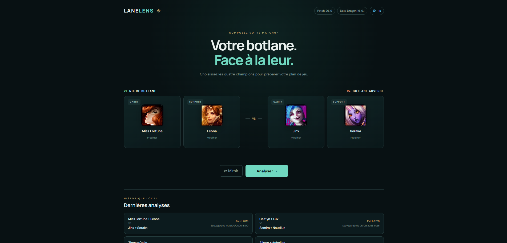

# LaneLens

> Le plan de jeu de ta botlane avant que les sbires arrivent.

LaneLens aide les joueurs de League of Legends à comprendre **comment jouer un matchup botlane précis à partir des quatre champions présents**.

Choisissez votre carry, votre support et la botlane adverse. LaneLens transforme les interactions entre les quatre kits en un plan de jeu concret : quoi respecter, quand avancer, qui cibler, comment gérer la wave et quelles erreurs éviter.

<p align="center">
  
</p>

## Pourquoi LaneLens ?

Connaître les quatre champions ne suffit pas toujours à savoir comment jouer la lane.

Entre les timings de niveaux, les cooldowns, la wave, les fenêtres d'engage et les interactions entre carry et support, la vraie question est souvent beaucoup plus simple :

> **Qu'est-ce qu'on doit réellement faire dans cette botlane ?**

LaneLens est conçu pour répondre à cette question avec une analyse structurée, actionnable et centrée sur le **2v2 complet**, pas uniquement sur un duel champion contre champion.

## Comment ça marche ?

Sélectionnez les deux champions de votre botlane et les deux champions adverses, puis lancez l'analyse. LaneLens transforme ce 2v2 en un plan de jeu lisible avant d'entrer en partie.

<p align="center">
  
</p>

## Ce que LaneLens analyse

Pour chaque matchup, LaneLens produit notamment :

- un plan de lane ;
- les principales menaces adverses ;
- la réponse à ces menaces ;
- les fenêtres de trade et d'engage ;
- une condition de victoire ;
- le plan des niveaux 1, 2 et 3 ;
- la gestion de wave ;
- la cible prioritaire ;
- les changements après le niveau 6 ;
- les opportunités de roaming ;
- une cheat sheet copiable ;
- une règle essentielle à retenir.

L'objectif n'est pas de réciter les sorts des champions, mais de transformer le matchup en **décisions concrètes**.

## État du projet

LaneLens est en développement actif et se rapproche de sa première alpha.

Le parcours principal est déjà fonctionnel :

```text
4 champions
    ↓
analyse
    ↓
résumé tactique
    ↓
analyse détaillée
    ↓
historique local
```

Le parcours principal, l'interface responsive et le socle d'internationalisation sont désormais en place. Les travaux actuels portent principalement sur la conformité gameplay des analyses, la conformité Riot, la remontée de feedback testeur et la préparation du déploiement de l'alpha.

## Fonctionnalités

### Disponible

- sélection des quatre champions de la botlane ;
- recherche instantanée dans le catalogue League of Legends ;
- portraits et données champions via Riot Data Dragon ;
- gestion des matchups miroir ;
- moteur d'analyse backend provider-agnostic ;
- providers OpenAI, Google Gemini et Groq ;
- contexte de patch versionné ;
- API `POST /api/matchup` ;
- endpoint `GET /api/analysis-context` ;
- validation structurelle des analyses avant affichage ;
- résumé tactique ;
- analyse détaillée du matchup ;
- cheat sheet copiable ;
- historique local des dix dernières analyses ;
- logs backend structurés avec `X-Request-Id` ;
- diagnostic sécurisé des erreurs provider ;
- interface française par défaut avec architecture i18n `fr-FR` ;
- locale propagée jusqu'au provider et validation de la cohérence linguistique des analyses.

### En cours

- garde-fous de conformité gameplay des analyses ;
- conformité Riot avant ouverture de l'alpha ;
- remontée de bugs et d'analyses incorrectes par les testeurs ;
- préparation du déploiement de la première alpha.

> La validation actuellement livrée garantit le contrat et la cohérence structurelle de la réponse. Les garde-fous destinés à détecter des impossibilités gameplay déterministes sont encore en cours de développement.

## Philosophie du projet

LaneLens cherche à rester simple :

```text
4 champions
      ↓
1 matchup
      ↓
1 plan de jeu clair
```

Pas de compte Riot obligatoire, pas de statistiques envahissantes et pas de dashboard complexe pour répondre à une question de lane.

---

# Pour les développeurs

## Stack

```text
Frontend    TypeScript · Vite · HTML · CSS
Backend     Node.js · Hono
Data        Riot Data Dragon
AI          MatchupAnalysisProvider · OpenAI · Google Gemini · Groq
Storage     localStorage côté navigateur
Logs        JSON Lines côté serveur
Tests       TypeScript · Node.js
```

## Démarrage local

Prérequis : Node.js >= 22.12.0 et npm.

```sh
npm ci
npm run dev
```

Ouvrir :

```text
http://127.0.0.1:5173
```

Cette commande lance le frontend Vite et l'API Hono ensemble.

Le backend est disponible sur :

```text
http://127.0.0.1:3000
```

Le health check :

```http
GET /api/health
```

retourne :

```json
{
  "status": "ok"
}
```

Le contexte d'analyse courant est exposé par :

```http
GET /api/analysis-context
```

## Configuration de l'analyse IA

Aucune clé n'est nécessaire pour démarrer l'application ou utiliser `GET /api/health`.

Pour activer une analyse réelle :

```powershell
Copy-Item .env.example .env
```

Puis sélectionner un provider et renseigner sa clé uniquement dans le fichier local `.env`.

### Groq

```env
AI_PROVIDER=groq
GROQ_API_KEY=
GROQ_MODEL=openai/gpt-oss-120b
GROQ_TIMEOUT_MS=30000
```

### OpenAI

```env
AI_PROVIDER=openai
OPENAI_API_KEY=
OPENAI_MODEL=gpt-6-sol
OPENAI_TIMEOUT_MS=30000
```

### Gemini

```env
AI_PROVIDER=gemini
GEMINI_API_KEY=
GEMINI_MODEL=gemini-3.8-flash
GEMINI_TIMEOUT_MS=30000
```

Les modèles et timeouts sont configurables. Une valeur `AI_PROVIDER` absente conserve OpenAI pour compatibilité avec les configurations existantes.

Il n'existe aucun fallback automatique entre providers.

Sans clé exploitable pour le provider sélectionné :

```text
POST /api/matchup
→ 503 ANALYSIS_NOT_CONFIGURED
```

Les secrets restent exclusivement côté serveur.

Ne jamais placer une clé dans :

```text
src/
public/
VITE_*
```

## Architecture

Le moteur d'analyse reste indépendant du provider concret :

```text
Frontend
   ↓
POST /api/matchup
   ↓
Hono
   ↓
PatchContextResolver
   ↓
MatchupAnalysisService
   ↓
MatchupAnalysisProvider
   ↓
Provider concret
   ↓
validation LaneLens
   ↓
MatchupAnalysis
```

Le contrôleur HTTP ne dépend d'aucun SDK LLM. Le runtime choisit le provider à partir de la configuration, puis l'injecte derrière `MatchupAnalysisProvider`.

Changer de modèle ou de provider ne doit pas nécessiter de modifier :

- le frontend ;
- le contrat HTTP ;
- `MatchupAnalysisService` ;
- le contrat `MatchupAnalysis`.

LaneLens conserve la responsabilité :

- du contexte de patch ;
- des instructions métier ;
- de la validation finale de la structure d'analyse ;
- de la traduction des erreurs en contrat HTTP sûr.

Voir [Architecture technique](docs/architecture.md) et [ADR-001](docs/decisions/ADR-001-remplacer-openclaw-runtime.md).

## Contexte de patch

Le patch utilisé pour l'analyse n'est pas déduit automatiquement de la version Data Dragon.

Les contextes supportés sont préparés et versionnés côté serveur.

Contexte actuellement embarqué :

```text
26.19-v1
```

Voir [Maintenance des contextes de patch](docs/patch-context.md).

## Test manuel de l'analyse

Renseigner la clé du provider sélectionné dans le fichier local `.env`, puis démarrer le backend :

```sh
npm run dev:server
```

Exemple :

```sh
curl -X POST http://127.0.0.1:3000/api/matchup \
  -H "Content-Type: application/json" \
  -d '{
    "allyCarry": "Ziggs",
    "allySupport": "Galio",
    "enemyCarry": "Jinx",
    "enemySupport": "Swain",
    "patch": "26.19",
    "locale": "fr-FR"
  }'
```

Avec une configuration valide, la réponse attendue est un `MatchupAnalysis` avec HTTP 200.

Ce test manuel n'est jamais exécuté par `npm test`.

## Catalogue des champions

Le catalogue est chargé depuis Riot Data Dragon en `fr_FR`.

LaneLens :

- recherche la dernière version Data Dragon disponible ;
- conserve le dernier catalogue valide dans `localStorage` ;
- réutilise ce cache si Data Dragon devient temporairement indisponible ;
- ne nécessite aucune clé Riot.

La version Data Dragon est une version technique et n'est pas utilisée comme détection automatique du patch joueur.

## Champion Picker

L'interface propose quatre slots :

```text
Carry allié
Support allié
Carry adverse
Support adverse
```

La recherche est insensible à la casse et les sélections restent modifiables.

Les doublons sont bloqués dans une même équipe.

Le mode Mirror permet au même champion d'apparaître une fois dans chaque équipe.

## Historique local

Les analyses valides affichées peuvent être conservées localement dans le navigateur.

L'historique :

- conserve au maximum dix entrées ;
- mémorise un snapshot des quatre champions, le patch, la locale, l'analyse et la date de génération ;
- remplace une entrée existante pour le même matchup/patch/locale ;
- reste consultable sans dépendre du catalogue Data Dragon courant ;
- ne nécessite aucune base de données.

Clé actuelle :

```text
lanelens.matchup-history.v2
```

## Logs backend

Le serveur écrit des logs structurés JSON Lines dans un répertoire local créé automatiquement au démarrage.

Par défaut :

```text
./logs/lanelens-YYYY-MM-DD.log
```

Configuration :

```env
LOG_DIR=./logs
LOG_LEVEL=info
LOG_RETENTION_DAYS=14
```

Chaque requête reçoit un `X-Request-Id` qui permet de corréler les événements HTTP, analyse et provider.

Les clés, tokens, cookies, mots de passe et secrets sont masqués. Les prompts complets, contextes de patch complets et réponses LLM complètes ne sont pas journalisés.

Le dossier `logs/` est ignoré par Git.

## Vérification du projet

```sh
npm run typecheck
npm test
npm run build
```

La compilation produit :

```text
dist/
├── client/
└── server/
```

## Périmètre actuel

Le MVP reste volontairement léger :

- pas d'authentification ;
- pas de base de données ;
- pas de compte Riot ;
- pas de Riot API authentifiée ;
- pas de fallback automatique entre providers ;
- pas de déploiement public livré à ce stade ;
- pas d'analytics produit détaillée.

## Documentation

- [Architecture technique](docs/architecture.md)
- [ADR-001 — Rendre OpenClaw remplaçable dans le runtime](docs/decisions/ADR-001-remplacer-openclaw-runtime.md)
- [Maintenance des contextes de patch](docs/patch-context.md)

## Références techniques

- [Vite](https://vite.dev/guide/)
- [Hono sur Node.js](https://hono.dev/docs/getting-started/nodejs)
- [Riot Data Dragon](https://developer.riotgames.com/docs/lol#data-dragon)
