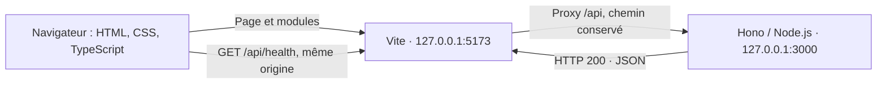

# Architecture — LaneLens

État documenté : socle technique LAN-001, au 24 septembre 2026.

Ce document décrit le code effectivement livré. Le [cahier des charges](cahier-des-charges.md)
décrit la cible produit ; les fonctionnalités futures ne sont pas encore implémentées.

## Vue d'ensemble

Application web TypeScript légère, sans React, Angular ou Vue, composée d'un
frontend servi par Vite et d'un backend Node.js avec Hono. Aucun stockage ni
service externe n'est nécessaire au fonctionnement actuel.



Le proxy est une configuration de développement Vite, pas une solution de
déploiement. Le navigateur utilise une URL relative ; il n'appelle pas directement
le port 3000. Aucun middleware CORS n'est ajouté pour ce flux de même origine.
Les deux services écoutent uniquement sur l'interface locale.

## Organisation et responsabilités

| Fichier ou répertoire | Responsabilité actuelle |
|---|---|
| `index.html` | Entrée HTML, métadonnées, conteneur `#app`, chargement de `src/main.ts`. |
| `src/main.ts` | Construction du DOM, état de connexion, appel initial et bouton de nouvelle vérification. |
| `src/api.ts` | Appel HTTP de santé, délai maximal de 5 secondes et validation minimale de la réponse. |
| `src/styles/main.css` | Présentation sombre et responsive, styles des états et du focus clavier. |
| `src/champions.ts` | Module réservé, aucune donnée champion ni intégration Data Dragon. |
| `src/storage.ts` | Module réservé, aucun accès à localStorage pour l'instant. |
| `src/components/` | Répertoire réservé aux futurs modules DOM, conservé via `.gitkeep`. |
| `server/index.ts` | Création de l'application Hono, route de santé et serveur HTTP via `@hono/node-server`. |
| `server/types.ts` | Type serveur `HealthResponse`, dont `status` est le littéral `'ok'`. |
| `server/openclaw.ts` | Module réservé à une future intégration exclusivement serveur. |
| `server/prompt.ts` | Module réservé aux futurs prompts. |
| `public/` | Répertoire réservé aux assets publics, actuellement sans asset applicatif. |
| `vite.config.ts` | Adresse frontend, port fixe, proxy API et sortie du build frontend. |
| `tsconfig.json` | Vérification du frontend et de la configuration Vite. |
| `tsconfig.server.json` | Vérification et compilation du backend Node.js. |
| `.env.example` | Documentation des futures variables OpenClaw, sans valeurs secrètes. |
| `package.json` / `package-lock.json` | Dépendances, commandes et verrouillage des versions installées. |

Le frontend n'importe aucun module serveur. Il vérifie la réponse JSON à
l'exécution ; le type serveur ne constitue pas à lui seul une validation réseau.

## Contrat API et flux de santé

Seule route applicative implémentée :

```http
GET /api/health
```

Réponse : HTTP **200**, contenu JSON exactement :

```json
{"status":"ok"}
```

Cette route indique que le serveur répond. Elle ne teste ni OpenClaw ni un autre
service et ne nécessite aucune configuration externe.

1. Au chargement de la page, `refreshHealth()` désactive temporairement le bouton.
2. `checkHealth()` appelle `/api/health` avec `fetch` et un délai maximal de 5 secondes.
3. Vite transmet la requête à Hono, sans réécrire le chemin.
4. Le client vérifie un statut HTTP de succès et un objet JSON contenant `status: 'ok'`.
   Il ne rejette pas d'éventuelles propriétés supplémentaires ; le serveur émet
   néanmoins le corps exact demandé par le ticket.
5. L'interface affiche « Service disponible » ou un message d'indisponibilité,
   puis réactive le bouton. Les erreurs HTTP, réseau, de délai et de format
   aboutissent au même état d'échec. Il n'y a pas de nouvelle tentative automatique.

L'état est annoncé via une zone `role="status"` avec `aria-live="polite"`.
Les routes métier `/api/matchup` et `/api/patch` ne sont pas implémentées.

## Exécution et compilation

Prérequis déclaré : Node.js >= 22.12.0 et npm. Le projet utilise les modules ESM
(`"type": "module"`). Les versions exactes résolues sont dans `package-lock.json`.

| Commande | Effet |
|---|---|
| `npm ci` | Installe les dépendances à partir du verrou npm. |
| `npm run dev` | Lance les deux processus via `concurrently --kill-others`. |
| `npm run dev:client` | Lance Vite sur `127.0.0.1:5173`, avec `strictPort`. |
| `npm run dev:server` | Lance le backend avec rechargement via `tsx watch`. |
| `npm run typecheck` | Contrôle TypeScript des deux configurations, sans émission. |
| `npm run build` | Contrôle les types, produit le frontend, puis compile le backend. |
| `npm run start:server` | Exécute `dist/server/index.js`, sans servir le frontend. |

Les ports 5173 et 3000 sont fixés dans le code et doivent être libres. Vite ne
choisit pas silencieusement un autre port. Le backend ferme le serveur sur
`SIGINT` ou `SIGTERM`, avec une limite de 5 secondes avant sortie forcée.

### Séparation des configurations TypeScript

- **Frontend** : cible ES2022, bibliothèques DOM, modules ESNext, résolution
  `Bundler`, mode strict et `noEmit`. Vite produit les assets navigateur.
- **Backend** : cible ES2022, résolution et modules `NodeNext`, types Node,
  mode strict ; `tsc` produit le JavaScript à partir de `server/`.
- Les imports relatifs côté serveur utilisent l'extension `.js`, correspondant
  aux fichiers exécutés après compilation.

```text
dist/
├── client/    # HTML et assets construits par Vite
└── server/    # Modules JavaScript compilés par TypeScript
```

Aucun serveur de fichiers statiques de production n'est configuré. La topologie
de déploiement, TLS et reverse proxy sont hors périmètre de LAN-001.

## Configuration et sécurité

Variables documentées, mais **non consommées actuellement** :

```dotenv
OPENCLAW_URL=
OPENCLAW_API_KEY=
```

Le socle fonctionne sans `.env`. Aucun chargement applicatif de configuration
OpenClaw ni appel à ce service n'est implémenté.

- La future clé OpenClaw devra rester exclusivement côté serveur.
- Aucun secret ne doit être placé dans `src/`, `public/` ou une variable `VITE_*`.
- `.gitignore` exclut `.env`, `.env.*` sauf `.env.example`, ainsi que les fichiers
  `*.local`, les dépendances, les builds et les journaux.
- L'exclusion Git ne retire pas un fichier déjà suivi : tout ajout de
  configuration devra continuer à respecter cette frontière.

## Limites et extensions prévues

Le socle ne comporte aucune base de données, authentification, Riot API,
persistance, CI/CD, Docker ou fonctionnalité de déploiement.

Le cahier des charges prévoit ensuite la sélection de champions, Data Dragon,
le patch, l'analyse via OpenClaw et l'affichage des résultats. Les modules
réservés facilitent ces évolutions sans préjuger de leurs contrats définitifs.
Leur présence ne signifie pas que ces fonctionnalités existent déjà.

## Vérification

Les contrôles effectués et leurs limites sont consignés dans le
[rapport de vérification LAN-001](LAN-001/verification.md).
Les instructions de démarrage sont dans le [README](../README.md).
