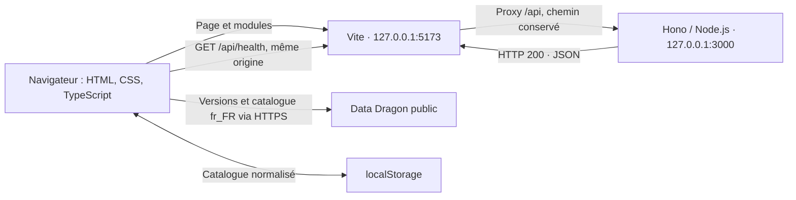

# Architecture — LaneLens

État documenté : socle LAN-001 et catalogue Data Dragon LAN-002, au 24 septembre 2026.

Ce document décrit le code effectivement livré. Le [cahier des charges](cahier-des-charges.md)
décrit la cible produit ; les fonctionnalités futures ne sont pas encore implémentées.

## Vue d'ensemble

Application web TypeScript légère, sans React, Angular ou Vue, composée d'un
frontend servi par Vite et d'un backend Node.js avec Hono. Le frontend charge
directement le catalogue public Data Dragon et conserve son dernier état valide
dans `localStorage`. Le contrôle de santé du backend reste indépendant.



Le proxy est une configuration de développement Vite, pas une solution de
déploiement. Le navigateur utilise une URL relative ; il n'appelle pas directement
le port 3000. Aucun middleware CORS n'est ajouté pour ce flux de même origine.
Les deux services écoutent uniquement sur l'interface locale.

## Organisation et responsabilités

| Fichier ou répertoire | Responsabilité actuelle |
|---|---|
| `index.html` | Entrée HTML, métadonnées, conteneur `#app`, chargement de `src/main.ts`. |
| `src/main.ts` | Construction du DOM, santé du backend et déclenchement du catalogue au démarrage. |
| `src/api.ts` | Appel HTTP de santé, délai maximal de 5 secondes et validation minimale de la réponse. |
| `src/styles/main.css` | Présentation sombre et responsive, styles des états et du focus clavier. |
| `src/champions.ts` | Contrats du catalogue, récupération Data Dragon, validation, normalisation, cache et repli. |
| `src/catalog-state.ts` | État partagé et promesse d'initialisation unique par chargement de l'application. |
| `src/storage.ts` | Accès JSON à localStorage, protégé contre les erreurs de lecture et d'écriture. |
| `tests/champions.test.ts` | Tests des parcours catalogue, validation du cache, pannes et état partagé. |
| `src/components/` | Répertoire réservé aux futurs modules DOM, conservé via `.gitkeep`. |
| `server/index.ts` | Création de l'application Hono, route de santé et serveur HTTP via `@hono/node-server`. |
| `server/types.ts` | Type serveur `HealthResponse`, dont `status` est le littéral `'ok'`. |
| `server/openclaw.ts` | Module réservé à une future intégration exclusivement serveur. |
| `server/prompt.ts` | Module réservé aux futurs prompts. |
| `public/` | Répertoire réservé aux assets publics, actuellement sans asset applicatif. |
| `vite.config.ts` | Adresse frontend, port fixe, proxy API et sortie du build frontend. |
| `tsconfig.json` | Vérification du frontend et de la configuration Vite. |
| `tsconfig.server.json` | Vérification et compilation du backend Node.js. |
| `.env.example` | Documentation des futures variables OpenClaw, sans valeurs secrètes. |
| `package.json` / `package-lock.json` | Dépendances, commandes et verrouillage des versions installées. |

Le frontend n'importe aucun module serveur. Il vérifie la réponse JSON à
l'exécution ; le type serveur ne constitue pas à lui seul une validation réseau.

## Contrat API et flux de santé

Seule route applicative implémentée :

```http
GET /api/health
```

Réponse : HTTP **200**, contenu JSON exactement :

```json
{"status":"ok"}
```

Cette route indique que le serveur répond. Elle ne teste ni OpenClaw ni un autre
service et ne nécessite aucune configuration externe.

1. Au chargement de la page, `refreshHealth()` désactive temporairement le bouton.
2. `checkHealth()` appelle `/api/health` avec `fetch` et un délai maximal de 5 secondes.
3. Vite transmet la requête à Hono, sans réécrire le chemin.
4. Le client vérifie un statut HTTP de succès et un objet JSON contenant `status: 'ok'`.
   Il ne rejette pas d'éventuelles propriétés supplémentaires ; le serveur émet
   néanmoins le corps exact demandé par le ticket.
5. L'interface affiche « Service disponible » ou un message d'indisponibilité,
   puis réactive le bouton. Les erreurs HTTP, réseau, de délai et de format
   aboutissent au même état d'échec. Il n'y a pas de nouvelle tentative automatique.

L'état est annoncé via une zone `role="status"` avec `aria-live="polite"`.
Les routes métier `/api/matchup` et `/api/patch` ne sont pas implémentées.

## Exécution et compilation

Prérequis déclaré : Node.js >= 22.12.0 et npm. Le projet utilise les modules ESM
(`"type": "module"`). Les versions exactes résolues sont dans `package-lock.json`.

| Commande | Effet |
|---|---|
| `npm ci` | Installe les dépendances à partir du verrou npm. |
| `npm run dev` | Lance les deux processus via `concurrently --kill-others`. |
| `npm run dev:client` | Lance Vite sur `127.0.0.1:5173`, avec `strictPort`. |
| `npm run dev:server` | Lance le backend avec rechargement via `tsx watch`. |
| `npm run typecheck` | Contrôle TypeScript des deux configurations, sans émission. |
| `npm test` | Exécute les tests TypeScript via `tsx` et le runner natif Node.js. |
| `npm run build` | Contrôle les types, produit le frontend, puis compile le backend. |
| `npm run start:server` | Exécute `dist/server/index.js`, sans servir le frontend. |

Les ports 5173 et 3000 sont fixés dans le code et doivent être libres. Vite ne
choisit pas silencieusement un autre port. Le backend ferme le serveur sur
`SIGINT` ou `SIGTERM`, avec une limite de 5 secondes avant sortie forcée.

### Séparation des configurations TypeScript

- **Frontend** : cible ES2022, bibliothèques DOM, modules ESNext, résolution
  `Bundler`, mode strict et `noEmit`. Les tests sont également vérifiés par TypeScript.
  Vite produit les assets navigateur, sans inclure les tests dans le bundle.
- **Backend** : cible ES2022, résolution et modules `NodeNext`, types Node,
  mode strict ; `tsc` produit le JavaScript à partir de `server/`.
- Les imports relatifs côté serveur utilisent l'extension `.js`, correspondant
  aux fichiers exécutés après compilation.

```text
dist/
├── client/    # HTML et assets construits par Vite
└── server/    # Modules JavaScript compilés par TypeScript
```

Aucun serveur de fichiers statiques de production n'est configuré. La topologie
de déploiement, TLS et reverse proxy sont hors périmètre de LAN-001.

## Configuration et sécurité

Variables documentées, mais **non consommées actuellement** :

```dotenv
OPENCLAW_URL=
OPENCLAW_API_KEY=
```

Le socle fonctionne sans `.env`. Aucun chargement applicatif de configuration
OpenClaw ni appel à ce service n'est implémenté.

- La future clé OpenClaw devra rester exclusivement côté serveur.
- Aucun secret ne doit être placé dans `src/`, `public/` ou une variable `VITE_*`.
- `.gitignore` exclut `.env`, `.env.*` sauf `.env.example`, ainsi que les fichiers
  `*.local`, les dépendances, les builds et les journaux.
- L'exclusion Git ne retire pas un fichier déjà suivi : tout ajout de
  configuration devra continuer à respecter cette frontière.

## Limites et extensions prévues

L'application ne comporte aucune base de données, authentification, API Riot
authentifiée, CI/CD, Docker ou fonctionnalité de déploiement. La seule persistance
applicative livrée est le cache local du catalogue.

Le cahier des charges prévoit ensuite la sélection de champions (LAN-003),
le contexte de patch de l'analyse, OpenClaw et l'affichage des résultats.
La version technique du catalogue est connue mais ne constitue pas une détection
du patch du client régional. Les modules OpenClaw et prompt restent réservés.

## Catalogue Data Dragon — LAN-002

### Source et normalisation

Le frontend interroge `https://ddragon.leagueoflegends.com/api/versions.json`
et utilise la première version du flux, classé de la plus récente à la plus ancienne.
Il demande ensuite `/cdn/{version}/data/fr_FR/champion.json` sur le même domaine.
Chaque appel possède un délai maximal de 5 secondes et utilise `cache: 'no-cache'`
pour revalider les réponses HTTP. Aucun secret ni en-tête d'authentification n'est utilisé.

Chaque champion conserve l'identifiant textuel `id`, le nom français `name` et
une URL `/cdn/{version}/img/champion/{image.full}`. Le champ racine `version`
du catalogue reçu doit correspondre à la version demandée. Catalogue vide,
identifiants dupliqués, champs invalides ou noms de fichiers inattendus sont rejetés.
Les noms localisés ne sont jamais utilisés comme identifiants techniques.

### Persistance et fraîcheur

Clé : `lanelens.champion-catalog.v1`. L'entrée contient `champions`,
`dataDragonVersion`, `locale: 'fr_FR'` et `fetchedAt` (date ISO de récupération).
La provenance et l'état obsolète sont calculés au chargement, pas pris du cache.

| Situation | Résultat |
|---|---|
| Réseau disponible, aucun cache ou version différente | Catalogue validé, sauvegardé, `source: network`, `stale: false`. |
| Cache valide de même version | Pas de téléchargement complet, `source: cache`, `stale: false`. |
| Versions ou nouveau catalogue indisponibles/invalides avec cache valide | Ancien catalogue inchangé, `source: cache`, `stale: true`. |
| Échec sans cache valide | `status: error`, code `CATALOG_UNAVAILABLE`. |
| Écriture localStorage refusée | Catalogue réseau utilisable, `persistence: unavailable` ; pas de promesse de persistance. |

La validation du cache contrôle structure, locale, date, version, identifiants
uniques et URLs de portraits attachées à cette version. Un cache invalide est
ignoré. L'ancien cache n'est jamais supprimé avant récupération et validation
du remplaçant. La date n'est pas renouvelée lors d'une simple réutilisation.
Il n'y a pas de TTL : la version est recherchée à chaque démarrage.

### Contrat consommable et démarrage

`main.ts` appelle `initializeChampionCatalog()` sans bloquer l'interface ni la
vérification de santé. Le module `catalog-state.ts` expose :

- `initializeChampionCatalog(): Promise<CatalogResult>` : même promesse pour tous
  les appels pendant le cycle de vie de la page, donc pas de téléchargements par interaction.
- `getChampionCatalogState(): CatalogState` : état `idle`, `loading`, `ready` ou `error`.
- En succès : `catalog` contient champions, version, locale, source, stale et fetchedAt ;
  `persistence` vaut `saved` ou `unavailable`.
- En échec sans données : résultat contrôlé avec code et message, pas de liste vide
  présentée comme un catalogue valide. La présentation appartient aux futurs tickets UI.

Les objets du catalogue exposé, les champions et leur tableau sont gelés pour
éviter qu'un consommateur désynchronise données et version. `loadChampionCatalog()`
reste testable avec un transport et un stockage injectés ; en usage normal il
utilise `fetch` et le `localStorage` du navigateur.

### Limites

Pas de Champion Picker, filtrage par rôle, cache binaire des portraits ni nouvelle
route backend. Aucun service worker : l'application elle-même doit déjà être
chargée pour utiliser le catalogue hors connexion. La provenance Data Dragon
et l'absence de clé ne changent pas la frontière des secrets serveur.

## Vérification

Les contrôles effectués et leurs limites sont consignés dans le
[rapport de vérification LAN-001](LAN-001/verification.md) et le
[rapport de vérification LAN-002](LAN-002/verification.md).
Les instructions de démarrage sont dans le [README](../README.md).
