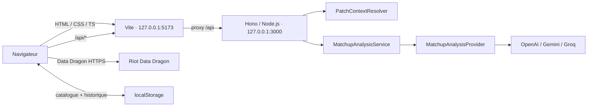

# Architecture — LaneLens

État documenté : architecture livrée au 26 septembre 2026, après mise en production alpha, CI/CD et instrumentation alpha.

Ce document décrit le code actuellement présent dans le dépôt. [ADR-001](decisions/ADR-001-remplacer-openclaw-runtime.md) formalise la décision de rendre le moteur d’analyse indépendant d’OpenClaw.

---

## Vue d’ensemble

LaneLens est une application web TypeScript légère, sans React, Angular ou Vue.

Elle est composée de :

- un frontend Vite + TypeScript + HTML/CSS ;
- un backend Node.js + Hono ;
- Riot Data Dragon pour les données statiques champions ;
- un moteur d’analyse IA derrière l’abstraction `MatchupAnalysisProvider` ;
- un `PatchContext` versionné géré par LaneLens ;
- un historique local dans `localStorage` ;
- des logs backend structurés JSONL.

En développement local :



Le proxy Vite est uniquement une commodité de développement. En production, Hono sert également le frontend compilé depuis `dist/client/`. Le déploiement public actuel est réalisé sur Render depuis la branche `production`.

---

## Flux principal d’analyse

Le parcours actuellement livré est :

```text
sélection des quatre champions
        ↓
GET /api/analysis-context
        ↓
POST /api/matchup
        ↓
validation HTTP
        ↓
PatchContextResolver
        ↓
MatchupAnalysisService
        ↓
MatchupAnalysisProvider
        ↓
provider concret
        ↓
validation structurelle LaneLens
        ↓
MatchupAnalysis
        ↓
Quick Overlay + Full Analysis
        ↓
historique local
```

Le provider concret reste interchangeable.

---

## Contrats partagés

Les contrats HTTP et le contrat de résultat sont définis dans :

```text
shared/analysis-contract.ts
```

### MatchupRequest

```ts
interface MatchupRequest {
  allyCarry: string;
  allySupport: string;
  enemyCarry: string;
  enemySupport: string;
  patch: string;
}
```

Le contrôleur exige actuellement exactement ces cinq propriétés, toutes non vides.

La locale fait désormais partie explicitement de `MatchupRequest` et est propagée jusqu’au provider et aux validateurs.

### MatchupAnalysis

`MatchupAnalysis` contient notamment :

- `matchup` ;
- `lanePlan` ;
- `threatResponseWindow` ;
- `earlyLevels` ;
- `wavePlan` ;
- `targetPriority` ;
- `postLevel6` ;
- `roamPlan` ;
- `cheatSheet` ;
- `goldenRule` ;
- `sources?`.

Le frontend et le backend dépendent de ce contrat partagé, mais le frontend effectue également une validation runtime de la réponse reçue.

---

## Backend

### Composition runtime

La composition est centralisée dans :

```text
server/runtime.ts
```

Le runtime :

1. lit `AI_PROVIDER` ;
2. choisit `openai`, `gemini` ou `groq` ;
3. vérifie la présence de la clé correspondante ;
4. charge la configuration du provider ;
5. instancie le provider ;
6. injecte ce provider dans `MatchupAnalysisService` ;
7. fournit le resolver de patch et le contexte d’analyse à l’application Hono.

Sans clé exploitable pour le provider sélectionné, le serveur démarre quand même mais `POST /api/matchup` retourne `ANALYSIS_NOT_CONFIGURED`.

Une valeur `AI_PROVIDER` vide conserve actuellement OpenAI pour compatibilité.

Il n’existe aucun fallback automatique entre providers.

---

## Provider abstraction

Interface :

```ts
export interface MatchupAnalysisProvider {
  analyze(request: MatchupAnalysisProviderRequest): Promise<unknown>;
}
```

Le type de sortie est volontairement `unknown`.

Le provider ne décide donc jamais seul qu’une réponse est valide. LaneLens conserve la responsabilité de la validation finale.

Providers actuellement livrés :

```text
OpenAIProvider
GeminiProvider
GroqProvider
```

Les détails de SDK, authentification, timeout et protocole restent confinés à leurs modules respectifs.

---

## MatchupAnalysisService

```text
server/analysis/MatchupAnalysisService.ts
```

Responsabilités actuelles :

1. valider l’entrée métier ;
2. construire les instructions avec `buildMatchupAnalysisInstructions()` ;
3. appeler le provider ;
4. transformer un échec provider en `ANALYSIS_PROVIDER_UNAVAILABLE` tout en conservant sa cause ;
5. valider la réponse avec `validateMatchupAnalysis()`.

Le service ne connaît ni Hono ni le transport HTTP.

Après la validation structurelle, le service applique désormais une validation de conformité gameplay déterministe puis une validation de cohérence linguistique.

---

## Validation actuelle

```text
server/analysis/validation.ts
```

La validation serveur vérifie aujourd’hui :

- structure du `PatchContext` ;
- présence des champs obligatoires ;
- correspondance entre les quatre champions demandés et retournés ;
- correspondance du patch ;
- présence des sections d’analyse ;
- tableau `cheatSheet` non vide ;
- structure et URL des sources.

Une réponse invalide devient :

```text
INVALID_ANALYSIS_RESPONSE
```

Important : la validation structurelle reste distincte de la validation gameplay. Le validateur de conformité détecte plusieurs impossibilités déterministes et incohérences textuelles, mais ne constitue pas une preuve formelle de justesse tactique.

---

## API Hono

L’application est construite dans :

```text
server/app.ts
```

Routes actuellement livrées :

```http
GET  /api/health
GET  /api/analysis-context
POST /api/matchup
POST /api/feedback
POST /api/telemetry
```

### GET /api/health

Retour :

```json
{
  "status": "ok"
}
```

Cette route ne contacte aucun provider et ne vérifie aucune clé externe.

### GET /api/analysis-context

Expose :

```ts
interface AnalysisContextResponse {
  patch: string;
  contextVersion: string;
}
```

Le frontend utilise cette route pour connaître le patch effectivement supporté pour l’analyse.

### POST /api/matchup

Le contrôleur :

1. vérifie `Content-Type: application/json` ;
2. parse le JSON ;
3. exige exactement les cinq propriétés `MatchupRequest` ;
4. trim les chaînes ;
5. interdit les doublons dans une même équipe ;
6. résout le `PatchContext` ;
7. construit `MatchupAnalysisInput` ;
8. appelle `MatchupAnalysisService` ;
9. retourne le `MatchupAnalysis` validé.

---

## Mapping des erreurs HTTP

Les erreurs publiques restent provider-agnostic.

Codes actuellement exposés :

```text
UNSUPPORTED_MEDIA_TYPE
INVALID_JSON
INVALID_MATCHUP_REQUEST
PATCH_CONTEXT_NOT_FOUND
PATCH_CONTEXT_UNAVAILABLE
PATCH_CONTEXT_INVALID
ANALYSIS_NOT_CONFIGURED
ANALYSIS_PROVIDER_UNAVAILABLE
INVALID_ANALYSIS_RESPONSE
ANALYSIS_FAILED
INTERNAL_ERROR
```

Mappings principaux :

```text
415 → UNSUPPORTED_MEDIA_TYPE
400 → INVALID_JSON
422 → INVALID_MATCHUP_REQUEST / PATCH_CONTEXT_NOT_FOUND
503 → PATCH_CONTEXT_UNAVAILABLE / ANALYSIS_NOT_CONFIGURED / ANALYSIS_PROVIDER_UNAVAILABLE
502 → INVALID_ANALYSIS_RESPONSE
500 → PATCH_CONTEXT_INVALID / ANALYSIS_FAILED / INTERNAL_ERROR
```

Le frontend ne rend jamais directement le body technique provider.

### POST /api/feedback

Reçoit les signalements testeurs validés côté serveur puis les transmet à un tracker GitHub configurable. Les tokens et coordonnées du dépôt restent exclusivement côté serveur.

### POST /api/telemetry

Reçoit une télémétrie pseudonyme minimale basée sur un `clientId` local et un `sessionId` de session. Les événements couvrent notamment l’ouverture de l’application, les analyses, l’historique et le feedback.

---

## Request ID et diagnostic

Chaque requête reçoit un UUID serveur :

```http
X-Request-Id: ...
```

Ce request ID est :

- renvoyé au client ;
- utilisé dans les logs ;
- exploitable pour corréler une erreur frontend et les événements backend.

Le backend ignore un éventuel identifiant fourni par le client et génère toujours le sien.

---

## Logging

Le logging est abstrait derrière :

```text
server/logging/Logger.ts
```

En local, l’implémentation courante écrit des fichiers JSON Lines quotidiens. En production Render, LaneLens utilise stdout/stderr afin de s’intégrer au système de logs de la plateforme.

Configuration :

```env
LOG_DIR=./logs
LOG_LEVEL=info
LOG_RETENTION_DAYS=14
```

Événements importants :

```text
server_starting
server_started
server_stopping
server_stopped
analysis_provider_configured
http_request_completed
matchup_analysis_started
matchup_analysis_completed
matchup_analysis_failed
analysis_provider_failed
```

Les champs sensibles sont redacted.

Ne sont pas journalisés volontairement :

- clés API ;
- headers Authorization ;
- cookies ;
- tokens ;
- prompt complet ;
- PatchContext complet ;
- réponse LLM complète.

En production, la journalisation devra rester compatible avec un environnement où le filesystem local n’est pas nécessairement durable.

---

## PatchContext

Interfaces :

```text
server/patch-context/PatchContextResolver.ts
server/patch-context/VersionedPatchContextResolver.ts
```

Le resolver retourne :

```ts
type PatchContextResolution =
  | { status: 'ready'; context: PatchContext }
  | { status: 'not-found' }
  | { status: 'unavailable' };
```

Le contexte courant est embarqué dans :

```text
server/patch-context/data/contexts.ts
```

Contexte actuellement actif :

```text
patch          26.19
contextVersion 26.19-v1
```

La version Data Dragon n’est jamais utilisée automatiquement comme patch joueur.

---

## Data Dragon

Le frontend utilise Riot Data Dragon pour :

- récupérer la liste des versions ;
- charger le catalogue `fr_FR` ;
- récupérer nom, identifiant et portrait des champions.

Le catalogue validé est normalisé puis mis en cache dans `localStorage`.

Clé actuelle :

```text
lanelens.champion-catalog.v1
```

Si le réseau devient indisponible :

- cache valide → réutilisé ;
- cache ancien mais valide → utilisable comme stale ;
- aucun cache valide → erreur catalogue contrôlée.

La version technique Data Dragon est affichée telle quelle et n’est pas convertie implicitement en patch League.

---

## Frontend

### src/main.ts

Le frontend vanilla TypeScript gère actuellement :

- rendu de la page ;
- quatre slots de champions ;
- Champion Picker ;
- Mirror ;
- loading ;
- appel réel d’analyse ;
- Quick Overlay ;
- Full Analysis ;
- copie de la cheat sheet ;
- historique ;
- retour à une nouvelle analyse ;
- gestion des requêtes obsolètes.

Aucun framework UI n’est utilisé.

### src/api.ts

Expose :

```text
checkHealth()
getAnalysisContext()
analyzeMatchup()
```

`analyzeMatchup()` :

- envoie `POST /api/matchup` ;
- utilise un timeout de 30 secondes par défaut ;
- conserve le statut HTTP ;
- conserve un code LaneLens connu ;
- conserve le `X-Request-Id` ;
- ne transmet pas au rendu un body technique arbitraire ;
- valide le `MatchupAnalysis` côté client avant retour.

---

## Protection contre les réponses obsolètes

Le frontend utilise :

- un compteur de request ID local ;
- un `AbortController` ;
- une vérification de requête active.

Cela évite qu’une ancienne réponse réseau remplace une vue devenue plus récente.

Exemple :

```text
analyse A lancée
→ utilisateur ouvre l’historique
→ analyse A devient obsolète
→ réponse A arrive
→ réponse ignorée
```

---

## Quick Overlay

Le frontend dérive un résumé local depuis le `MatchupAnalysis`.

Aucun second appel IA n’est effectué.

Mapping principal :

```text
plan        ← lanePlan
threat      ← threatResponseWindow.threat
response    ← threatResponseWindow.response
opportunity ← threatResponseWindow.window
early       ← level1 / level2 / level3
mid         ← wavePlan / postLevel6 / roamPlan
target      ← targetPriority
goldenRule  ← goldenRule
```

LAN-008 prévoit de retravailler fortement la hiérarchie visuelle et de replier l’analyse détaillée par défaut.

---

## Historique local

Module :

```text
src/history.ts
```

Clé :

```text
lanelens.matchup-history.v1
```

L’historique conserve au maximum dix entrées.

Chaque entrée contient :

- snapshot des quatre champions ;
- patch ;
- `MatchupAnalysis` complet ;
- date ISO de génération.

L’identité logique actuelle est :

```text
patch
+ carry allié
+ support allié
+ carry adverse
+ support adverse
```

Le même matchup/patch remplace son entrée précédente et remonte en tête.

Une entrée invalide est ignorée individuellement lors de la lecture.

LAN-020 prévoit une nouvelle version incluant la locale.

---

## Sécurité

Frontière principale :

```text
navigateur
≠
secrets provider
```

Les secrets ne doivent jamais exister dans :

```text
src/
public/
VITE_*
```

Ils restent dans l’environnement serveur.

Le frontend reçoit uniquement :

- résultats métier ;
- codes d’erreur LaneLens ;
- request ID sûr.

---

## Configuration IA

`.env.example` documente actuellement :

```env
AI_PROVIDER=

OPENAI_API_KEY=
OPENAI_MODEL=gpt-6-sol
OPENAI_TIMEOUT_MS=30000

GEMINI_API_KEY=
GEMINI_MODEL=gemini-3.8-flash
GEMINI_TIMEOUT_MS=30000

GROQ_API_KEY=
GROQ_MODEL=openai/gpt-oss-120b
GROQ_TIMEOUT_MS=30000
```

Le backend ne charge que la configuration correspondant au provider sélectionné.

---

## Exécution

Prérequis :

```text
Node.js >= 22.12.0
npm
```

Commandes :

| Commande | Effet |
|---|---|
| `npm ci` | Installe les dépendances verrouillées. |
| `npm run dev` | Lance backend + Vite en parallèle. |
| `npm run dev:client` | Lance Vite. |
| `npm run dev:server` | Lance le backend via `tsx watch`. |
| `npm run typecheck` | Vérifie frontend + backend. |
| `npm test` | Exécute les tests TypeScript. |
| `npm run build` | Typecheck, build Vite puis compilation backend. |
| `npm run start:server` | Lance `dist/server/index.js`. |

Build :

```text
dist/
├── client/
└── server/
```

À ce stade, `start:server` ne sert pas encore `dist/client/`.

---

## Déploiement

Aucun déploiement public n’est encore livré dans le code courant.

La cible de production reste volontairement découplée du cœur métier : le frontend compilé et l’API pourront être servis derrière une infrastructure adaptée sans modifier les contrats métier ni les providers.

---

## Évolutions actuellement ouvertes

### LAN-008 — UX finale

Prévoit notamment :

- Quick Overlay comme vue principale ;
- Full Analysis repliée par défaut ;
- action `Nouveau matchup` toujours accessible ;
- réduction du nombre de cards ;
- timeline Early ;
- Threat → Response → Window comme signature visuelle ;
- reduced motion ;
- gestion d’erreur plus riche.

### LAN-019 — Conformité gameplay

Doit ajouter des garde-fous déterministes sur :

- capacité disponible au niveau annoncé ;
- ownership / slot des sorts ;
- interactions CC ;
- reset/refund de cooldown ;
- valeurs exactes non sourcées ;
- claims de lethal ;
- cohérence temporelle.

### LAN-020 — i18n

Doit introduire :

- `AppLocale` ;
- français par défaut ;
- catalogue de traductions ;
- locale dans le flux d’analyse ;
- validation de langue ;
- historique séparé par locale ;
- mapping Data Dragon par locale.


---

## Invariants architecturaux

- Le contrôleur HTTP ne connaît pas les SDK LLM.
- `MatchupAnalysisService` dépend de `MatchupAnalysisProvider`, jamais d’un provider concret.
- Le provider retourne `unknown`; LaneLens valide la sortie.
- Le patch et son contexte appartiennent à LaneLens.
- Data Dragon version et patch joueur restent distincts.
- Aucun secret provider n’est exposé au frontend.
- Aucun fallback automatique entre providers.
- L’historique utilisateur reste local pour le MVP actuel.
- OpenClaw n’est pas une dépendance runtime de LaneLens.
- Les améliorations UX ne doivent pas déclencher de deuxième génération IA.

---

## Références

- [ADR-001 — Rendre OpenClaw remplaçable dans le runtime](decisions/ADR-001-remplacer-openclaw-runtime.md)
- [Maintenance des contextes de patch](patch-context.md)
- [README](../README.md)


---

## Production et livraison

La branche `main` reste la branche de développement. La branche `production` représente l’état réellement déployé.

```text
feature
  ↓ PR
main
  ↓ promotion
production
  ↓
GitHub Actions CI
  ↓
Render
  ↓
Production Smoke Test
```

La CI exécute :

```text
npm ci
npm audit --audit-level=high
npm run lint
npm run typecheck
npm test
npm run build
```

Le smoke test de production attend le déploiement Render correspondant au commit de `production`, puis vérifie `GET /api/health` sur le service public.

Les branches `main` et `production` sont protégées.

---

## Points de vigilance actuels

Le socle est adapté à l’alpha, mais les sujets suivants restent ouverts avant une diffusion plus large :

- conformité Riot et mentions produit tiers ;
- protection renforcée contre l’abus des endpoints publics ;
- exploitation et mesure des warnings de conformité gameplay ;
- enrichissement progressif de la base de faits gameplay ;
- découpage progressif du frontend aujourd’hui encore concentré dans `src/main.ts` ;
- formalisation plus complète de la politique de confidentialité liée à la télémétrie.
